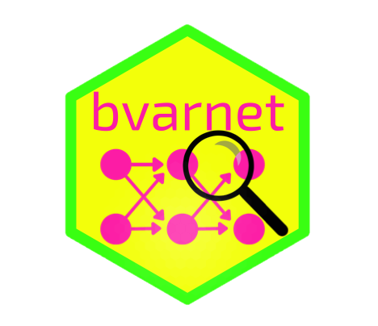

# bvarnet 


<!-- badges: start -->
[](https://github.com/flo1met/bvarnet/actions/workflows/R-CMD-check.yml)
[](https://app.codecov.io/gh/flo1met/bvarnet)
[](https://flo1met.github.io/bvarnet/)
<!-- badges: end -->

## Bayesian Estimation of Multilevel Vector Autoregressive Networks using `STAN`

The `bvarnet` package allows user to estimate Bayesian multilevel Vector Auto Regressive (VAR) models for binary, ordinal and continuous outcome variables. Missing data is handled through listwise deletion and a skip-lag mechanism, which skips the estimation of the temporal structure when there is a gap between two timepoints.
Further, we provide functionality to conduct hypothesis tests.

## Installation

To install `bvarnet` from CRAN, you need to have [CmdStanR](https://mc-stan.org/cmdstanr/index.html) installed which is not available on CRAN. To do this, make sure you have [RTools](https://cran.r-project.org/bin/windows/Rtools/) (Windows) or [Xcode](https://developer.apple.com/xcode/) (Mac) installed and the run the following code

```r
install.packages("cmdstanr", repos = c("https://mc-stan.org/r-packages/", getOption("repos")))
cmdstanr::check_cmdstan_toolchain(fix = TRUE)
cmdstanr::install_cmdstan(cores = 2)
```

If you run into any problems, you can look at the [Getting started with CmdStanR](https://mc-stan.org/cmdstanr/articles/cmdstanr.html) guide.

After setting up cmdstanr you can install the newest version of the package from CRAN:
```r
install.packages("bvarnet", type = "source")
```

Or you can install the development version of `bvarnet` from [GitHub](https://github.com/flo1met/bvarnet) with:

``` r
if(!requireNamespace("remotes")) {
  install.packages("remotes")
}
remotes::install_github("flo1met/bvarnet")
```

## Getting Started

The best place to start learning how to use this package to estimate Bayesian (multilevel) Vector Autoregression is the [Getting Started Vignette](https://flo1met.github.io/bvarnet/articles/bvarnet.html).
This vignette covers the basic model syntax, how to specify priors and how to extract the relevant parameters.

## Feature Requests and Contributions

- Predictions
- Cross-sectional Networks
- Correlated Random Effects
- Hierarchical Prior Distributions
- Performance Optimisation

## Roadmap

`bvarnet` is actively being developed. While the core functionality is stable, we have several features planned for future releases. For bug reports or feature request, please visit our [Issue Tracker](https://github.com/flo1met/bvarnet/issues).

