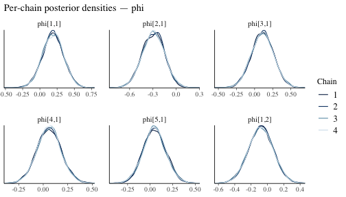
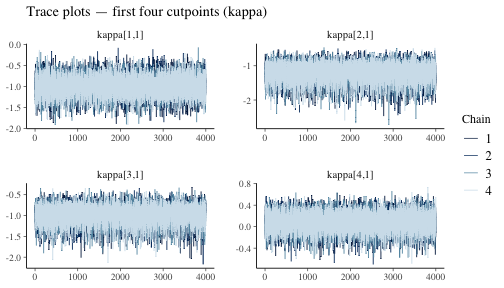

# MCMC-Diagnostics

``` r
library(bvarnet)
library(bayesplot)
#> This is bayesplot version 1.15.0
#> - Online documentation and vignettes at mc-stan.org/bayesplot
#> - bayesplot theme set to bayesplot::theme_default()
#>    * Does _not_ affect other ggplot2 plots
#>    * See ?bayesplot_theme_set for details on theme setting
```

## Introduction

`bvarnet` uses the No-U-Turn Sampler (NUTS), a variant of Hamiltonian
Monte Carlo (HMC), via CmdStan. Unlike simple Metropolis-Hastings, NUTS
adapts the step-size and trajectory length automatically during a warmup
phase, making it very efficient for the high-dimensional, correlated
posteriors typical of multilevel VAR models. Even so, every MCMC
analysis should pass a set of standard diagnostic checks before results
are interpreted.

This vignette covers:

1.  Fitting a model with sensible defaults
2.  Convergence diagnostics: R-hat and Effective Sample Size
3.  Trace plots for visual inspection
4.  Sampler-level warnings: divergences and exceeded tree depth
5.  Tuning the sampler via `iter`, `warmup`, `adapt_delta`, and
    `max_treedepth`

For a deeper treatment of HMC/NUTS theory and every diagnostic described
here, see the [Stan Reference Manual — MCMC
Sampling](https://mc-stan.org/docs/reference-manual/mcmc.html) and the
community [Stan
Wiki](https://github.com/stan-dev/stan/wiki/Prior-Choice-Recommendations).

------------------------------------------------------------------------

## Fitting a Reference Model

We reuse the five-variable ordinal model from
[`vignette("bvarnet")`](https://flo1met.github.io/bvarnet/articles/bvarnet.md).
The same `studentlife` data are used throughout.

``` r
data(studentlife)

priors <- set_priors(
  phi   = prior(family = "normal", loc = 0, scale = 0.5),
  kappa = prior(family = "normal", loc = 0, scale = 1)
)
```

``` r
fit <- bvar(
  id_col   = "id",
  time_col = "day",
  y_cols   = c("anxious", "calm", "conventional", "critical", "dependable"),
  K        = 1,
  data     = studentlife,
  family   = "ordinal",
  priors   = priors,
  iter     = 4000,
  warmup   = 1000,
  chains   = 4,
  cores    = 4,
  seed     = 1337
)
```

``` r
print(fit)
#> BVAR Network fit
#> ======================================== 
#> Family:      ordinal
#> Outcomes (p): 5 
#> Lags (K):     1 
#> Fixed eff.:   0 
#> Observations: 147 
#> Rhat max:    1.001
#> Divergences: 1  WARNING: check model/priors.
#> Priors:
#>   beta   ~ Normal(0, 1)  (default)
#>   phi    ~ Normal(0, 0.5)
#>   kappa  ~ Normal(0, 1)
#> Total time:  20.2 sec
#> ========================================
```

------------------------------------------------------------------------

## R-hat: Between-Chain Convergence

**R-hat** ($\widehat{R}$) measures whether independent chains have
converged to the same distribution by comparing within-chain to
between-chain variance. A value of $\widehat{R} \approx 1$ indicates
that all chains are exploring the same region of parameter space.

**Rule of thumb:** $\widehat{R} \leq 1.01$ is the modern criterion.
Values above 1.01 suggest the chains have *not* converged and longer
sampling is needed.

The convergence table is stored in `fit$convergence` as a data frame
with one row per parameter, alongside bulk-ESS and tail-ESS.

``` r
head(fit$convergence)
#>   variable      rhat ess_bulk  ess_tail
#> 1     lp__ 1.0006264  5807.04  8763.894
#> 2 phi[1,1] 1.0002434 19633.01 11959.170
#> 3 phi[2,1] 0.9999424 16400.52 11459.448
#> 4 phi[3,1] 0.9999472 19919.94 12271.959
#> 5 phi[4,1] 1.0001548 29249.05 11530.322
#> 6 phi[5,1] 1.0000761 18623.57 12379.016
```

A quick summary of the R-hat distribution across all parameters:

``` r
rhat_vals <- fit$convergence$rhat
summary(rhat_vals)
#>    Min. 1st Qu.  Median    Mean 3rd Qu.    Max. 
#>  0.9999  1.0000  1.0001  1.0001  1.0002  1.0007
```

------------------------------------------------------------------------

## Effective Sample Size (ESS)

Even though NUTS chains produce correlated samples, the **Effective
Sample Size (ESS)** measures how many *independent* draws the correlated
sequence is worth. `bvarnet` stores two variants:

| Statistic  | Targets                                  | Minimum recommended |
|------------|------------------------------------------|---------------------|
| `ess_bulk` | Central tendency (mean, median)          | $\geq 400$          |
| `ess_tail` | Tail quantiles, credible interval bounds | $\geq 400$          |

``` r
ess_bulk <- fit$convergence$ess_bulk
ess_tail <- fit$convergence$ess_tail

cat("Bulk ESS — min:", round(min(ess_bulk, na.rm = TRUE)),
    "  median:", round(median(ess_bulk, na.rm = TRUE)), "\n")
#> Bulk ESS — min: 5807   median: 18210
cat("Tail ESS — min:", round(min(ess_tail, na.rm = TRUE)),
    "  median:", round(median(ess_tail, na.rm = TRUE)), "\n")
#> Tail ESS — min: 8764   median: 12304
cat("Parameters with bulk ESS < 400:", sum(ess_bulk < 400, na.rm = TRUE), "\n")
#> Parameters with bulk ESS < 400: 0
```

------------------------------------------------------------------------

## Trace Plots

A **trace plot** shows the sampled value of a parameter at each
iteration for every chain. Healthy chains look like a fuzzy caterpillar,
they mix rapidly and all chains overlap. Trends, spikes, or chains that
stay separated indicate sampling problems.

To investigate the trace plots, we can use the
[`mcmc_trace()`](https://mc-stan.org/bayesplot/reference/MCMC-traces.html)
from the `bayesplot` package.

``` r
phi_pars <- grep("^phi", dimnames(fit$draws)[[3]], value = TRUE)[1:6] # select some lag-coefficient parameters

mcmc_trace(fit$draws, pars = phi_pars) +
  ggplot2::labs(title = "Trace plots — first six lag coefficients (phi)")
```


plot of chunk trace-phi

Complementary **density overlay** plots show whether chain-specific
posteriors are consistent:

``` r
mcmc_dens_overlay(fit$draws, pars = phi_pars) +
  ggplot2::labs(title = "Per-chain posterior densities — phi")
```



plot of chunk density-phi

We can do this for any sampled parameter, for example the threshold
parameter kappa:

``` r
kappa_pars <- grep("^kappa", dimnames(fit$draws)[[3]], value = TRUE)[1:4]

mcmc_trace(fit$draws, pars = kappa_pars) +
  ggplot2::labs(title = "Trace plots — first four cutpoints (kappa)")
```



plot of chunk trace-kappa

------------------------------------------------------------------------

## Sampler Diagnostics: Divergences and Exceeded Tree Depth

Stan’s NUTS sampler reports two additional per-chain diagnostics stored
in `fit$diagnostics`:

``` r
fit$diagnostics
#>   num_divergent num_max_treedepth     ebfmi
#> 1             0                 0 0.8941142
#> 2             0                 0 0.9862093
#> 3             0                 0 0.9318894
#> 4             1                 0 0.9390785
```

### Divergences

A **divergence** occurs when the numerical integrator of HMC deviates
from the true Hamiltonian trajectory. Even a small number of divergences
can indicate that the sampler is missing regions of the posterior,
leading to **biased estimates**. They should *not* be ignored!

Common causes and remedies:

- **Funnel-shaped posterior** (common in hierarchical models)
- **Step size too large**: increase `adapt_delta` towards 1 (see below).
- **Model misspecification**: revisit the prior scale or model
  structure.

### Exceeded Tree Depth

To draw each new sample, NUTS simulates a trajectory through parameter
space, taking small steps and deciding when to turn around. The
`max_treedepth` argument (default 10) sets a hard limit on how long that
trajectory can be. When this warning appears, it means the sampler
wanted to keep exploring but was cut off — it hit the limit before it
was ready to stop. Unlike divergences, this does **not** mean the
results are biased. It is a **slowness warning**: the sampler is doing
extra work to produce each draw, so your effective sample size per hour
of compute time is lower than it could be. Increasing `max_treedepth`
gives the sampler more room to move, which typically resolves the
warning.

------------------------------------------------------------------------

## Tuning the Sampler

### Chain Length: `iter` and `warmup`

[`bvar()`](https://flo1met.github.io/bvarnet/reference/bvar.md) exposes
two length arguments:

| Argument | Default | Role                                                                                   |
|----------|---------|----------------------------------------------------------------------------------------|
| `warmup` | 1000    | Iterations used for adaptation (step-size, mass matrix). **Discarded** from inference. |
| `iter`   | 4000    | Post-warmup (sampling) iterations *per chain*. Used for inference.                     |

The total number of draws available for inference is `iter × chains` (16
000 with the defaults above). Increasing `iter` directly improves ESS at
a proportional computational cost. Increasing `warmup` can help when the
sampler struggles to find the typical set (visible as a long burn-in in
trace plots).

### `adapt_delta`: Controlling Divergences

`adapt_delta` (default 0.80) is the **target acceptance rate** that
Stan’s dual-averaging algorithm uses when adapting the step size during
warmup. A higher target forces a smaller step size, which reduces
discretisation error and typically eliminates divergences.

**Trade-off:** smaller step sizes mean shorter trajectories per unit
time, so ESS per second decreases. Increase `adapt_delta` only when you
observe divergences; do not set it near 1 unless needed.

Typical values:

| Situation                                     | `adapt_delta`          |
|-----------------------------------------------|------------------------|
| Default / no divergences                      | 0.80 (CmdStan default) |
| Some divergences                              | 0.90–0.95              |
| Persistent divergences in hierarchical models | 0.97–0.99              |

For full details see the [Stan reference on
`adapt_delta`](https://mc-stan.org/docs/reference-manual/mcmc.html#adaptation.section).

### `max_treedepth`: Controlling Trajectory Length

`max_treedepth` (default 10) caps the doubling steps NUTS may take. The
maximum trajectory length is $2^{\text{max\_treedepth}}$ leapfrog steps.

Increase this when `fit$diagnostics` shows a non-trivial number of
iterations hitting the tree-depth limit. Each additional level doubles
compute time per affected iteration, so increases of 1–2 beyond the
default are usually sufficient.

For full details see the [Stan reference on
`max_treedepth`](https://mc-stan.org/docs/reference-manual/mcmc.html#nuts-configuration).

------------------------------------------------------------------------

## Quick Checklist

Before reporting results from a `bvarnet` model:

1.  **R-hat**: all parameters $\leq 1.01$.
2.  **ESS**: `ess_bulk` and `ess_tail` $\geq 400$ for all parameters of
    interest.
3.  **Trace plots**: caterpillar-like mixing, no trends or stuck chains.
4.  **Divergences**: zero, or investigate with higher `adapt_delta`.
5.  **Tree-depth warnings**: none, or increase `max_treedepth`.
