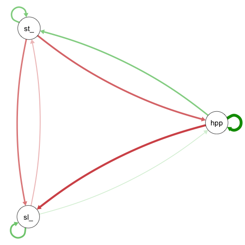

# Mixed-Model

``` r
library(bvarnet)
library(qgraph)
```

## Mixed-family VAR

`bvarnet` allows combining different outcome families in a single VAR
model by passing a named vector to the `family` argument. This is useful
when the variables in the network are measured on different scales.

In this example we fit a mixed-family VAR(1) with three types of
outcome:

- **ordinal**: `anxious` and `calm` (5-point Likert items)
- **binary**: `happyornot` (binarised daily average)
- **gaussian**: `sleep_duration` (hours)

## Load Data

Again, we start with loading the data

``` r
data(studentlife)
```

### Priors

For a mixed-family model we specify priors for all parameter types that
can appear. Here that means `phi` (temporal), `beta` (intercept / fixed
effects), `kappa` (ordinal thresholds), and `sigma` (gaussian residual
SD).

``` r
priors <- set_priors(
  phi   = prior(family = "normal", loc = 0, scale = 0.1),
  beta  = prior(family = "normal", loc = 0, scale = 1),
  kappa = prior(family = "normal", loc = 0, scale = 1),
  sigma = prior(family = "normal", loc = 0, scale = 1)
)
```

### Estimation

We pass a named character vector to `family` so that each outcome gets
the appropriate likelihood.

``` r
#potential bug: we were able to run with binary that were saved as numeric (and have decimals)
fit_mixed <- bvar(
  id_col   = "id",
  time_col = "day",
  y_cols   = c("stress_level", "happyornot", "sleep_duration"),
  x_cols   = NULL,
  re_cols  = NULL,
  re_temporal = FALSE,
  K        = 1,
  data     = studentlife,
  family   = c(stress_level = "ordinal",
               happyornot = "bernoulli",
               sleep_duration = "gaussian"),
  priors   = priors,
  iter     = 4000,
  warmup   = 2000,
  chains   = 4,
  cores    = 4,
  seed     = 1337
)
#> Error in `.to_stan_data_node()`:
#> ! Ordinal Y must contain integer values. Found non-integer entries.
```

### Results

``` r
print(fit_mixed)
#> Error:
#> ! object 'fit_mixed' not found
```

``` r
summary(fit_mixed)
#> Error:
#> ! object 'fit_mixed' not found
```

The temporal network can be extracted and inspected as usual:

``` r
nw_mat <- extract_network_matrix(fit_mixed)
#> Error:
#> ! object 'fit_mixed' not found
qgraph(nw_mat)
```



plot of chunk unnamed-chunk-7

As every other model, the mixed model can be extended by random effects
(`Vignette(Random-Effects)`), hypothesis tests can be performed
(`Vignette(Hypothesis-Testing)`) and predictions can be made based on
the model (`Vignette(Prediction)`).
