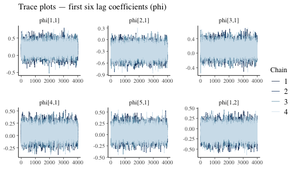

## Introduction

This package implements methods to analyse (multilevel) Vector Autoregression commonly used for the analysis of intensive longitudinal datasets like EMA data.

In the following vignette we will introduce the basic functionality of the package. For more elaborated usecases, we refer to the additional vignettes

- `vignette("Hypothesis-Testing")`
- `vignette("Mixed-Model")`
- `vignette("Missing-Data")`
- `vignette("Random-Effects")`
- `vignette("MCMC-Diagnostics")`


## Setup

First, lets load the package:

``` r
library(bvarnet)
library(qgraph)
```

## Data

Now, we can load the example data:

``` r
data(studentlife)
```

There is some missing data in the dataset. The models default options handle this by themselves. For a further elaboration on this, you can read `vignette("Missing-Data")`.

Currently, `bvarnet` allowes for the following outcome variables:

- binary (`family = "bernoulli")`
- ordinal (`family = "ordinal")` (adjacent category model)
- continuous (`family = "gaussian")`

For the following tutorial we will investigate the temporal network for the variables `anxious`, `calm`, `conventional`, `critical`, and `dependable`. All these variables are on a ordinal scale. Therefore we will use the adjacent category ordinal model to estimate this model.

## Prior Specification

First we need to specify the prior distributions that we want to use on the parameters.
For this we can use the `set_priors()` function. As we are running a ordinal model, without covariates, we have to specify priors on the temporal structure (denoted by the $\Phi$ matrix) and on the category threshold parameters ($\kappa$) which is specific to the adjacent category ordinal model.


``` r
priors <- set_priors(phi = prior(family = "normal",
                                 loc = 0,
                                 scale = 0.5),
                     kappa = prior(family = "normal",
                                   loc = 0,
                                   scale = 1))

priors
#> bvarnet prior specification:
#>   phi    ~ Normal(0, 0.5)
#>   kappa  ~ Normal(0, 1)
```

Currently, three prior families are implemented: normal, student-t and chauchy. For standart deviations and random effects all of these priors are automatically scaled to half-priors. 
For each distribution, the location and scale parameters can be specified. For the student-t distribution, the degrees of freedom can also be specified.

## Model Estimation


``` r
fit <- bvar(
  id_col = "id",
  time_col = "day",
  y_cols = c("anxious", "calm", "conventional", "critical", "dependable"),
  x_cols = NULL,
  re_cols = NULL,
  re_temporal = FALSE,
  K = 1,
  data = studentlife,
  family = c("ordinal"),
  priors = priors,
  iter = 4000,
  warmup = 1000,
  chains = 4,
  cores = 4,
  seed = 1337
)
```

If you want to learn how to extend this model to a multilevel model, check out the `Vignette(Random-Effects)`.

## Stan Warnings

Most models will give a warning when initiating sampling, that looks like this:

```text
Chain 1 Informational Message: The current Metropolis proposal is about to be rejected because of the following issue:
Chain 1 Exception: categorical_logit_glm_lpmf: Intercept[3] is -inf, but must be finite! (in '/var/folders/n5/38kfmkv55hq8bnd03344d2b40000gn/T/RtmpkjgDq1/model-a60f79e9a37c.stan', line 153, column 8 to column 94)
Chain 1 If this warning occurs sporadically, such as for highly constrained variable types like covariance matrices, then the sampler is fine,
Chain 1 but if this warning occurs often then your model may be either severely ill-conditioned or misspecified.
Chain 1
```

This warning is printed by Stan when a proposed draw briefly violates internal constraints (here, producing a non-finite intercept), so that proposal is rejected. As long as it occurs only occasionally and the chains run, converge, and pass standard diagnostics, this warning is expected and can be safely ignored.

## Model Output

We can print an overview of the model we just ran using the `print(fit)` functions:

``` r
print(fit)
#> BVAR Network fit
#> ======================================== 
#> Family:      ordinal
#> Outcomes (p): 5 
#> Lags (K):     1 
#> Fixed eff.:   0 
#> Observations: 147 
#> Rhat max:    1.001
#> Divergences: 1  WARNING: check model/priors.
#> Priors:
#>   beta   ~ Normal(0, 1)  (default)
#>   phi    ~ Normal(0, 0.5)
#>   kappa  ~ Normal(0, 1)
#> Total time:  12.6 sec
#> ========================================
```

Here we get information about the number of variables and lags, the number of observations and some first indications if the model did converge.

### Summary

To further inspect the model parameters we can use the `summary(fit)` function:


``` r
summary(fit)
#> BVAR Network Summary
#> ================================================== 
#> Family: ordinal | p=5 | K=1 | n=147
#> Rhat max: 1.001 | Divergences: 1
#>   WARNING: divergent transitions detected — check model/priors.
#> 
#> --- Autoregressive ---
#>  predictor         outcome      mean  median q5     q95   rhat  ess_bulk ess_tail
#>  lag1_anxious      anxious      0.190 0.191  -0.064 0.441 1.000 19633.01 11959.17
#>  lag1_calm         calm         0.173 0.173  -0.057 0.409 1.001 15187.45 12033.26
#>  lag1_conventional conventional 0.522 0.522   0.252 0.801 1.000 18655.99 12661.32
#>  lag1_critical     critical     0.273 0.270   0.066 0.492 1.001 24042.28 12349.77
#>  lag1_dependable   dependable   0.459 0.456   0.228 0.697 1.000 19660.02 12414.55
#> 
#> 
#> --- Cross-lagged ---
#>  predictor         outcome      mean   median q5     q95    rhat ess_bulk ess_tail
#>  lag1_calm         anxious      -0.295 -0.293 -0.534 -0.064 1    16400.52 11459.45
#>  lag1_conventional anxious       0.109  0.110 -0.145  0.363 1    19919.94 12271.96
#>  lag1_critical     anxious       0.059  0.059 -0.142  0.266 1    29249.05 11530.32
#>  lag1_dependable   anxious       0.049  0.047 -0.156  0.259 1    18623.56 12379.02
#>  lag1_anxious      calm         -0.080 -0.080 -0.331  0.168 1    19087.17 12676.98
#>  lag1_conventional calm         -0.157 -0.157 -0.416  0.100 1    17990.79 12297.06
#>  lag1_critical     calm         -0.073 -0.072 -0.279  0.137 1    30605.37 12311.23
#>  lag1_dependable   calm          0.110  0.108 -0.096  0.318 1    18954.26 13189.49
#>  lag1_anxious      conventional -0.172 -0.174 -0.438  0.096 1    19308.78 12656.36
#>  lag1_calm         conventional -0.102 -0.100 -0.343  0.136 1    15993.48 13042.57
#> 
#> ... 10 more rows. Use extract_temporal(fit, effect = "cl") for full output.
#> 
#> --- Threshold ---
#>  predictor               outcome mean   median q5     q95    rhat ess_bulk ess_tail
#>  kappa(anxious, c1)      —       -0.987 -0.986 -1.396 -0.581 1    17267.83 10548.39
#>  kappa(calm, c1)         —       -1.201 -1.168 -1.711 -0.796 1    17288.56 10950.22
#>  kappa(conventional, c1) —       -0.986 -0.967 -1.385 -0.648 1    19490.40 12274.73
#>  kappa(critical, c1)     —        0.089  0.097 -0.234  0.380 1    16714.72 12274.38
#>  kappa(dependable, c1)   —       -1.514 -1.475 -2.193 -0.969 1    13656.79 10635.92
#>  kappa(anxious, c2)      —        0.442  0.448  0.125  0.737 1    15943.52 12871.09
#>  kappa(calm, c2)         —       -0.843 -0.835 -1.179 -0.539 1    18624.66 13571.76
#>  kappa(conventional, c2) —       -0.686 -0.687 -0.976 -0.388 1    18078.73 13500.06
#>  kappa(critical, c2)     —        0.529  0.528  0.287  0.775 1    17260.78 14724.44
#>  kappa(dependable, c2)   —       -0.832 -0.833 -1.218 -0.444 1    17188.28 10192.67
#> 
#> ... 10 more rows. Use extract_param(fit, type = "Threshold") for full output.
#> 
#> ==================================================
#> Use extract_param() or extract_param(fit, type = "...") for the full parameter table.
#> Use extract_network_matrix() for the temporal network matrix.
```

### Extracting Parameters

Here we can see, that we can not see all category threshold parameters ($\kappa$). To inspect them completely we have to extract them using `extract_param(fit, type = "Threshold")`:


``` r
params <- extract_param(fit, type = "Threshold")
params
#>         type               predictor outcome        mean     median         q5         q95      rhat ess_bulk ess_tail
#> 26 Threshold      kappa(anxious, c1)       — -0.98739947 -0.9860493 -1.3959425 -0.58128709 1.0002899 17267.83 10548.39
#> 27 Threshold         kappa(calm, c1)       — -1.20056112 -1.1684911 -1.7108714 -0.79625675 1.0001173 17288.56 10950.22
#> 28 Threshold kappa(conventional, c1)       — -0.98550582 -0.9670843 -1.3851722 -0.64823757 1.0000965 19490.40 12274.73
#> 29 Threshold     kappa(critical, c1)       —  0.08918956  0.0971121 -0.2338354  0.38037924 1.0000410 16714.72 12274.38
#> 30 Threshold   kappa(dependable, c1)       — -1.51421608 -1.4750196 -2.1928847 -0.96885779 0.9999901 13656.79 10635.93
#> 31 Threshold      kappa(anxious, c2)       —  0.44160030  0.4480043  0.1246503  0.73744380 1.0001864 15943.52 12871.09
#> 32 Threshold         kappa(calm, c2)       — -0.84343255 -0.8350261 -1.1789986 -0.53859744 0.9999530 18624.66 13571.76
#> 33 Threshold kappa(conventional, c2)       — -0.68574365 -0.6871833 -0.9757996 -0.38764781 1.0000669 18078.73 13500.06
#> 34 Threshold     kappa(critical, c2)       —  0.52905562  0.5279551  0.2874228  0.77458323 1.0002312 17260.78 14724.44
#> 35 Threshold   kappa(dependable, c2)       — -0.83224176 -0.8331054 -1.2180161 -0.44414506 1.0004728 17188.28 10192.67
#> 36 Threshold      kappa(anxious, c3)       —  0.91591078  0.9039044  0.5767963  1.29100115 0.9999471 16410.18 13830.48
#> 37 Threshold         kappa(calm, c3)       — -0.35622581 -0.3623932 -0.6523983 -0.04375198 0.9999353 15096.12 13654.72
#> 38 Threshold kappa(conventional, c3)       —  0.61041320  0.6068505  0.2562171  0.97513834 1.0001069 15027.75 12162.08
#> 39 Threshold     kappa(critical, c3)       —  0.73137454  0.7238967  0.4781784  1.01258300 1.0000583 18194.09 14135.84
#> 40 Threshold   kappa(dependable, c3)       —  0.12394548  0.1239607 -0.2146176  0.46524592 1.0001516 12629.71 10121.86
#> 41 Threshold      kappa(anxious, c4)       —  1.64429481  1.6027258  1.0616271  2.36308576 1.0000596 15643.85 11786.75
#> 42 Threshold         kappa(calm, c4)       —  1.28145587  1.2735726  0.8468702  1.73513969 0.9999143 21851.63 11834.63
#> 43 Threshold kappa(conventional, c4)       —  2.21871737  2.2052999  1.5672800  2.91469544 1.0002161 18781.33 10564.61
#> 44 Threshold     kappa(critical, c4)       —  1.06503664  1.0262242  0.6818237  1.57819682 0.9998645 19805.16 13097.76
#> 45 Threshold   kappa(dependable, c4)       —  1.08776225  1.0817278  0.6448819  1.56455443 1.0003547 14400.05 10104.37
```

## Network Visualization

If we are interested in the temporal network structure, we can inspect this using either the `extract_temporal(fit)`, or the `extract_network_matrix(fit)` functions. Here we will use the `extract_network_matrix(fit)` to plot the network:


``` r
nw_mat <- extract_network_matrix(fit)
qgraph(nw_mat)
```



Lastly, if you want to perform hypothesis tests on your estimated parameters we refer you to the `Vignette(Hypothesis-Testing)`.
